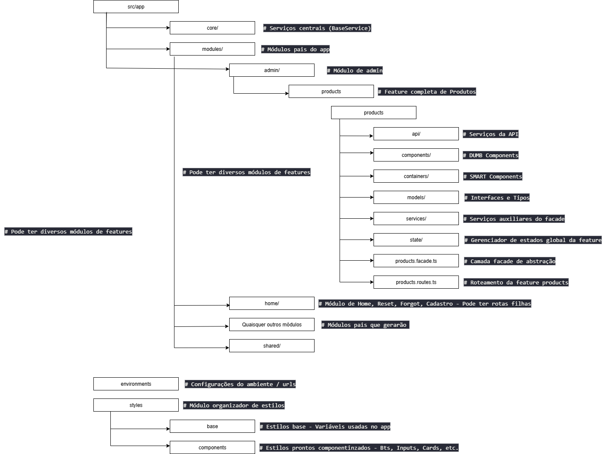
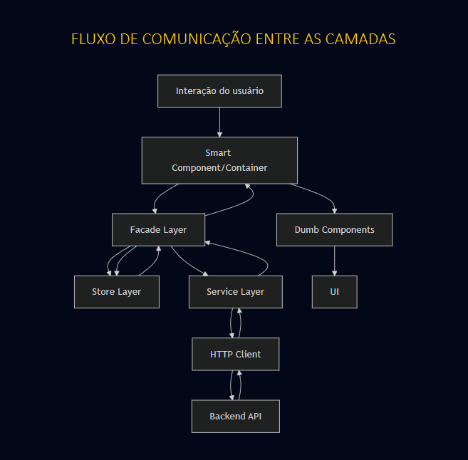
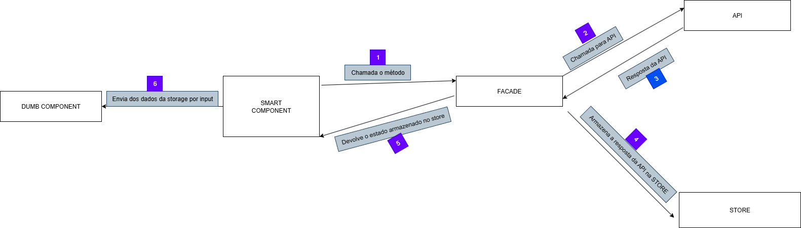
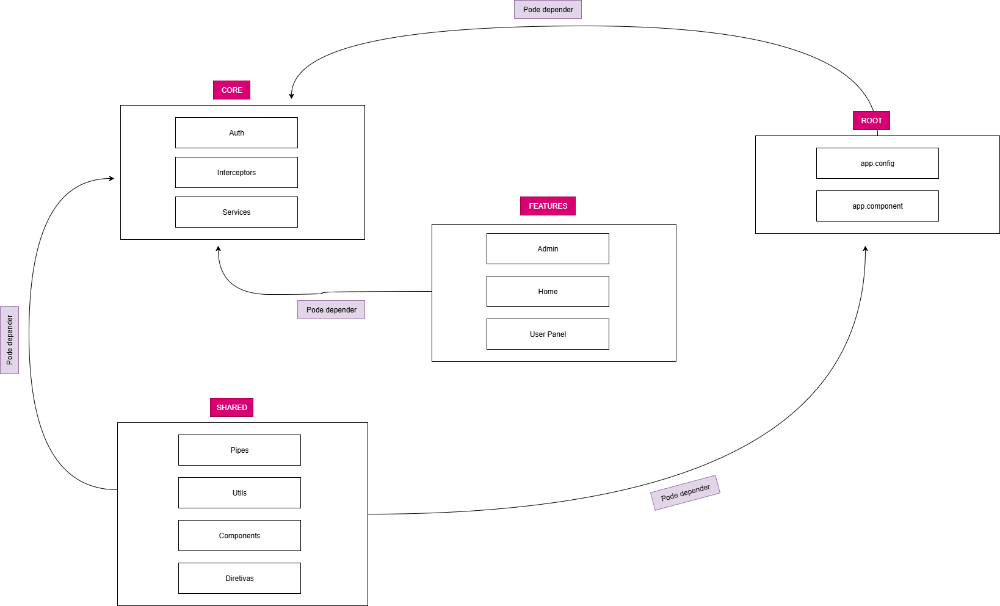

# Visão Geral da Arquitetura

O projeto implementa uma arquitetura modular baseada em Angular com padrões que promovem escalabilidade, manutenibilidade e reutilização de código. A arquitetura segue os princípios **SOLID**, **Clean Architecture**, **DRY**, **YAGNI** e **KISS**, implementando padrões como **Facade**, **Store**, **Smart/Dumb Components** e **Service Layer**.

## Padrões Arquiteturais Implementados

### 1. **Facade Pattern** 
O **ProductsFacade** atua como uma camada de abstração que abstrai a comunicação entre componentes e a lógica de negócio:

```typescript
@Injectable({ providedIn: 'root' })
export class ProductsFacade {
  private api = inject(ProductsApiService);
  private store = inject(ProductsStore);
  private filtersService = inject(ProductFiltersService);
  
  // Exposição de observables para componentes
  products$ = this.store.products$;
  filteredProducts$ = this.store.filteredProducts$;
  loading$ = this.store.loading$;
  
  // Métodos de alto nível
  loadProducts() { /* orquestra API + Store */ }
  applyFilters(filters: IProductFilters) { /* aplica filtros */ }
  createProduct(product: IProduct) { /* CRUD operations */ }
}
```

### 2. **Store Pattern**
O **ProductsStore** gerencia o estado da aplicação usando BehaviorSubjects:

```typescript
@Injectable({ providedIn: 'root'})
export class ProductsStore {
  private productsSubject = new BehaviorSubject<IProduct[]>([]);
  private filteredProductsSubject = new BehaviorSubject<IProduct[]>([]);
  private loadingSubject = new BehaviorSubject<boolean>(false);
  
  // Observables expostos
  products$ = this.productsSubject.asObservable();
  filteredProducts$ = this.filteredProductsSubject.asObservable();
  loading$ = this.loadingSubject.asObservable();
  
  // Métodos para atualizar estado
  setProducts(products: IProduct[]) { /* ... */ }
  setFilteredProducts(products: IProduct[]) { /* ... */ }
  addProduct(product: IProduct) { /* ... */ }
}
```

### 3. **Arquitetura Modular** 


### 4. **Smart/Dumb Components Pattern**

#### **Smart Components (Containers)**
- **Localização**: `containers/`
- **Responsabilidade**: Gerenciamento de estado LOCAL, inscrição no estado exposto pelo facade, comunicação com facade
- **Exemplo**: `ProductListPageComponent`

```typescript
@Component({...})
export class ProductListPageComponent implements OnInit {
  private productsFacade = inject(ProductsFacade);
  
  // Estados locais
  currentPage = signal(1);
  filters = signal<IProductFilters>({});
  
  // Observables do facade e inscrição via template
  products$ = this.productsFacade.filteredProducts$;
  loading$ = this.productsFacade.loading$;
  
  // Métodos de negócio
  onEdit(id: number) { /* navegação */ }
  onDelete(id: number) { /* confirmação + exclusão */ }
}
```

#### **Dumb Components**
- **Localização**: `components/`
- **Responsabilidade**: Apresentação, eventos, inputs/outputs para os SMART components
- **Exemplo**: `ProductCardComponent`

```typescript
@Component({...})
export class ProductCardComponent {
  product = input<IProduct>();
  
  edit = output<number>();
  delete = output<number>();
  
  onEdit() { this.edit.emit(this.product()!.id); }
  onDelete() { this.delete.emit(this.product()!.id); }
}
```


## Fluxo Completo de Dados e Comunicação

### **1. Arquitetura em Camadas**


### **2. Fluxo Detalhado - Carregamento de Produtos**



## Sistema de Roteamento

### Organização das rotas
- Através desta organização, a aplicação se torna totalmente expansível através de módulos (admin, usuario, franquia, home, landing-pages, etc...)

### **Lazy Loading Modular**
```typescript
// app.routes.ts
{
  path: 'admin',
  loadChildren: () => import('./modules/admin/admin.routes')
}

// products.routes.ts
{
  path: '',
  loadComponent: () => import('./containers/product-list-page/product-list-page.component')
}
```

### **Benefícios do Lazy Loading**
- **Performance**: Carregamento sob demanda
- **Bundle Size**: Chunks menores
- **Initial Load**: Tempo de carregamento inicial reduzido

## Service CRUD base

### **BaseService Pattern**
- Esse serviço atua como uma classe abstrata as quais os facades podem consumir para realizar ações CRUD sem precisar conhecer a url, ou lidar diretamente com HTTP
- Atua como mais uma camada de abstração entre facade e back-end. 
- Com essa abstração se quisermos mudar de REST API para GRAPHQL posteriormente, basta acessarmos essa camada
- Atua no princípio de Liskov Substitution Principle (LSP) do SOLID.

```typescript
export class BaseService<T> {
  protected BASE_URL: string = '';
  
  findAll(): Observable<T[]> { /* ... */ }
  create(body: T): Observable<T> { /* ... */ }
  findById(id: number): Observable<T> { /* ... */ }
  update(id: number, body: Partial<T>): Observable<T> { /* ... */ }
  delete(id: number): Observable<T> { /* ... */ }
}
```

### **Facades**
```typescript
export class ProductsApiService extends BaseService<IProduct> {
  constructor(protected override readonly http: HttpClient) { 
    super(http)
    this.BASE_URL = 'products';
  }
}
```

## Benefícios da Arquitetura

### **1. Escalabilidade** 
- **Módulos independentes**: Fácil adição de novas features
- **Lazy loading**: Performance otimizada
- **Padrões consistentes**: Possui design patterns que podem ser entendidos por outros devs

### **2. Manutenção** 
- **Separação de responsabilidades**: Código organizado
- **Abstrações**: Mudanças isoladas
- **Testabilidade**: Projeto todo modular facilita os testes

### **3. Performance** 
- **OnPush strategy**: Separação entre DUMB e SMART deixa claro que DUMB deve possuir sempre OnPush Strategy
- **Signals**: Estado reativo eficiente utilizado nos estados locais, simplificando o component

### **4. Desenvolvimento** 
- **Arquitetura previsível**: Desenvolvedores sabem onde encontrar código por estar totalmente modular
- **Manuteção**: As abstrações deixam claro onde cada ponto deve receber manutenção

## O que a arquitetura aceita receber?

### **1. State Management Avançado**
- Implementação de NgRx ou Akita
- Store centralizado para estado global
- Effects para side effects

### **2. Diversos módulos**
- Pelo app.route é possível a crição de módulos pais que geraram seus respectivos filhos, gerando várias seções
- Seções que podem ser implementadas: Painel admin, painel usuário, landing pages, cadastro, login, e mais.


## Convenções e Boas Práticas

### **Nomenclaturas**
- **Interfaces**: PascalCase + I prefix
- **Enums**: PascalCase

## **Camadas de abstração**
- Criação de facades para ligar o smart component à API
- Utilização do baseApiService pelo facade para utilização de métodos CRUD
- SMART Componentes lida com estado local com signals, recebe estado global e se inscrevia via template e em último caso RxJs
- DUMB Components não faz lógica, apenas recebe dados e emite eventos (input / output)
- Serviços especializados para serem injetados no facade, retirando responsabilidades que não são inerentes a ele.
- A criação no módulo CORE são de artifícios que serão utilizados apenas uma vez na aplicação

## Dependencias de pastas


### - [VOLTAR AO ARQUIVO PRINCIPAL](../../README.md)