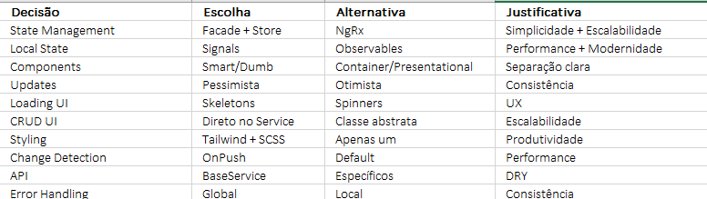

# Decisões Técnicas

## Visão Geral

Este documento detalha as decisões técnicas tomadas durante o desenvolvimento do projeto, explicando o **porquê** de cada escolha e as **alternativas** consideradas.

## Decisões Arquiteturais

### 1. **Facade Pattern**

#### **Decisão**: Implementar Facade Pattern
```typescript
@Injectable({ providedIn: 'root' })
export class ProductsFacade {
  private api = inject(ProductsApiService);
  private store = inject(ProductsStore);
  
  products$ = this.store.products$;
  loadProducts() { /* orquestra API + Store */ }
}
```

#### **Por que usar Facade?**
- **Desacoplamento**: Os componentes não precisam conhecer os detalhes de chamadas à API, stores ou serviços, o facade faz esse "meio de campo".  
- **Centralização da lógica**: Toda a orquestração de estado e regras de negócio fica em um ponto único, no facade. 
- **Testabilidade**: Facilita criar testes unitários, pois os componentes interagem apenas com o facade.  
- **Flexibilidade**: Mudanças internas (ex.: trocar serviço de estado ou API) não afetam os componentes.  


#### **Alternativas consideradas**:
- **Acesso direto aos serviços**: Rejeitado, pois aumentaria o acoplamento entre componentes e lógica de negócio e não é escalável, é ruim de testar, etc.
- **Gerenciamento de estado com NgRx**: Avaliado, mas considerado overkill para o escopo atual 
- **EventEmitter entre componentes**: Não escalável e tornaria a manutenção mais complexa.  

#### **Desvantagens**:
- Há um pouco mais de complexidade para decidir o que deve ser responsabilidade do facade e o que não deve
- Deve-se tomar cuidado para não inflar de mais o facade e quebrar o princípio da responsabilidade


### 2. **Store Pattern – RxJS vs Signals**

#### **Decisão**: Abordagem híbrida  
- **Store com RxJS** para estado global e comunicação entre features.  
- **Facade com RxJs** para orquestrar a comunicação entre store e signals, fazendo toda a complexidade
- **Signals** para estado local e reativo dentro do componente.  

```typescript
// Estado global (Store com RxJS)
@Injectable({ providedIn: 'root' })
export class ProductsStore {
  private readonly productsSubject = new BehaviorSubject<IProduct[]>([]);
  readonly products$ = this.productsSubject.asObservable();

  setProducts(products: IProduct[]) {
    this.productsSubject.next(products);
    this.filteredProductsSubject.next(products); 
  }
}

@Injectable({provideIn: 'root'})
export class ProductsFacade {
  products$ = this.store.products$;

  loadProducts() {
    this.store.setLoading(true);

    this.api.findAll()  
      .pipe(takeUntilDestroyed(this.destroyRef))
      .subscribe({
        next: products => {
          this.store.setProducts(products)
        },
        error: (err) => this.store.setLoading(false),
        complete: () => this.store.setLoading(false)
      })
  }
}

// Estado local (Signals)
@Component({...})
export class ProductListPageComponent {
  currentPage = signal(1);

  products$ = this.productsFacade.filteredProducts$;

  ngOnInit(): void {
    this.triggerProducts()
  }

  onPageChange(page: number) {
    this.currentPage.set(page);
    this.updatePaginatedProducts();
  }
}
```

### 3. **Smart/Dumb Components vs Container/Presentational**

#### **Decisão**: Smart/Dumb Components
```typescript
// Smart Component (Container)
@Component({...})
export class ProductListPageComponent {
  private productsFacade = inject(ProductsFacade);
  products$ = this.productsFacade.products$;
}

// Dumb Component (Presentational)
@Component({...})
export class ProductCardComponent {
  product = input<IProduct>();
  edit = output<number>();
}
```

#### **Por que Smart/Dumb?**
- **Separação clara**: Responsabilidades bem definidas entre que faz lógica e quem não 
- **Reutilização**: Dumb components são reutilizáveis e fáceis de manter
- **Manutenção**: Mudanças isoladas

#### **Alternativas**:
- **Container e Presentational**: Não é escalável, mistura lógica, estados, UI
- **Todos Smart**: Acoplamento forte
- **Todos Dumb**: Inchaço no facade que geraria o mesmo problema da primeira opção

## Decisões de Implementação

### 4. **Pessimista vs Otimista Updates**

#### **Decisão**: Pessimista updates
```typescript
createProduct(product: IProduct) {
  this.store.setLoading(true);
  
  this.api.create(product)
    .subscribe({
      next: created => {
        this.store.setNewProduct(created);
        this.toastr.success('Produto criado com sucesso.');
      },
      error: () => this.store.setLoading(false),
      complete: () => this.store.setLoading(false)
    });
}
```

#### **Por que Pessimista?**
- **Consistência**: Dados sempre corretos
- **Simplicidade**: Lógica mais direta
- **Rollback**: Não precisa reverter mudanças

#### **Alternativas consideradas**:
- **Otimista**: UI mais responsiva, mas complexa e pode gerar bugs
- **Híbrido**: Complexidade desnecessária

#### **Pros e Contras**:
- Contra do pessimista: **UX**: Usuário espera resposta do servidor
- Pró do pessimista: **Confiabilidade**: Dados sempre consistentes

## Decisões de UI/UX

### 5. **Skeletons vs Spinners**

#### **Por que Skeletons?**
- **UX**: Mostra estrutura da página para o usuário, tem mais interatividade
- **Percepção**: Usuário sente que carrega mais rápido do que loading
- **Consistência**: Mantém layout estável com a estrutura do skeleton igual da original
- **Visual**: Mais atrativo

#### **Alternativas consideradas**:
- **Spinners**: Também seria uma boa alternativa, mas optei por skeletons
- **Progress bars**: Não é tão atrativo e gera "ansiedade" ao usuário
- **Nada**: Usuário não sabe o que está acontecendo e pode executar múltiplas ações

### 6. **Modal vs Route para CRUD**

#### **Decisão**: Routes para CRUD operations
```typescript
// products.routes.ts
{
  path: 'create',
  loadComponent: () => import('./containers/product-create/product-create.component')
},
{
  path: 'edit/:id',
  loadComponent: () => import('./containers/product-edit/product-edit.component')
}
```

#### **Por que Routes?**
- **Escalabilidade**: Fácil de expandir caso precise de mais campos
- **Navegação**: URLs específicas e de fácil manunteção, o dev sabe onde está
- **Estado**: Não perde estado ao navegar
- **SEO**: URLs indexáveis para o SEO

#### **Alternativas consideradas**:
- **Modals**: Simples, mas limitado, não é escalável

### 7. **Tailwind CSS vs SCSS**

#### **Decisão**: Híbrido - Tailwind + SCSS
```scss
// styles/base/_colors.scss
$primary: #3b82f6;
$secondary: #64748b;

// tailwind.config.js
module.exports = {
  theme: {
    extend: {
      colors: {
        primary: '#3b82f6',
        secondary: '#64748b'
      }
    }
  }
}
```

#### **Por que híbrido?**
- **Produtividade**: Tailwind para utilitários
- **Consistência**: SCSS para temas
- **Centralização**: Cores centralizadas

#### **Alternativas consideradas**:
- **Angular Material**: Ótima alternativa com components prontos mas optei somente por tailwind
- **Bootstrap**: Ótima alternativa, mas tailwind considero mais produtivo e mais atrativo visualmente


## Decisões de Performance

### 8. **OnPush vs Default Change Detection**

#### **Decisão**: OnPush para todos os dumb componentes para melhor rastreabilidade junto com signals
```typescript
@Component({
  changeDetection: ChangeDetectionStrategy.OnPush
})
export class ProductCardComponent {
  product = input<IProduct>();
}
```

#### **Por que OnPush?**
- **Performance**: Menos verificações de mudança pelo zonejs, tendo mais rastreabilidade
- **Previsibilidade**: Controle sobre quando renderizar
- **Match com a DUMB**: Perfeito para dumb components na nossa arquitetura atual

#### **Alternativas consideradas**:
- **Default**: Menos performático e a arquitetura atual nos permite decidir facilmente quem tera onPush


### 9. **Signals vs Observables para Estado Local**

#### **Decisão**: Signals para estado local e observables para lógicas mais complexas no facade e store
```typescript
export class ProductListPageComponent {
  currentPage = signal(1);
  filters = signal<IProductFilters>({});
  
  onPageChange(page: number) {
    this.currentPage.set(page);
  }
}
```

#### **Por que Signals?**
- **Performance**: Maior rastreabilidade por parte do angular e melhor tratamento de memory leak.
- **Simplicidade**: Código mais limpo deixando o component mais enxuto e menos complexo
- **Modernidade**: O futuro do angular está nos signals, cada vez mais sendo implementados

#### **Alternativas consideradas**:
- **Observables**: Mais verboso e pede muito tratamento de subscrição para implementar no component
- **NgRx**: Overkill para estado local

## Decisões de Arquitetura

### 10. **BaseService vs Services Específicos**

#### **Decisão**: BaseService genérico
```typescript
export class BaseService<T> {
  protected BASE_URL: string = '';
  
  findAll(): Observable<T[]> {
    return this.http.get<T[]>(`${environment.api}/${this.BASE_URL}`);
  }
  
  create(body: T): Observable<T> {
    return this.http.post<T>(`${environment.api}/${this.BASE_URL}`, body);
  }
}

export class ProductsApiService extends BaseService<IProduct> {
  constructor(protected override readonly http: HttpClient) {
    super(http);
    this.BASE_URL = 'products';
  }
}
```

#### **Por que BaseService?**
- **DRY**: Evita repetição de código por todas as features que tiverem CRUD 
- **Consistência**: Mantem o padrão de utilização por toda a aplicação
- **Manutenibilidade**: Mudanças centralizadas no base_service, se houver mudança de API para graphQL ou mudança dos endpoints, só alteramos em um lugar.
- **Escalabilidade**: Fácil de expandir uma vez que os facades irão herdar desta classe e implementar somente novos endpoints específicos

#### **Alternativas que poderia ter seguidfo**:
- **Services específicos**: Mais código duplicado, gera acoplamento e incha o service com muitos métodos 

### 11. **Estratégia global para detecção de erros**

#### **Decisão**: Global Error Handler Inteceptor + Exception Filter Service

- Implementação de um interceptor para capturar erros globalmente
- Esse interceptor chama um serviço especializado em lidar com os status dos erros, esse service irá capturar o erro e mostrar uma mensagem user friendly, não precisando expor o erro recebido do backend.

```typescript
@Injectable()
export class ErrorHandlerInterceptor implements HttpInterceptor {
  intercept(req: HttpRequest<any>, next: HttpHandler): Observable<HttpEvent<any>> {
    return next.handle(req).pipe(
      catchError((error: HttpErrorResponse) => {
        this.errorFilterService.handleError(error);
        return throwError(() => error);
      })
    );
  }
}

export const errorHandlerInterceptor: HttpInterceptorFn = (req, next) => {
  const errorFilter = inject(ErrorFilterService);

  return next(req).pipe(
    catchError(error => {
      errorFilter.handleError(error);
      return throwError(() => error); // repassa o erro
    })
  );
};

```

#### **Por que Global Handler?**
- **Consistência**: Tratamento uniforme em um ponto específico da aplicação
- **Centralização**: Não precisa tratar em cada service, facade ou store, fica tudo centroalizado
- **UX**: Feedback visual consistente para o usuário, que não recebe um erro de código do backend na tela dele.

#### **Alternativas consideradas**:
- **Local handling**: Repetitivo, suja muito código, gera acoplamento, não mostra mensagens user friendly.

## Possibilidades futuras

### 12. **Migração para NgRx**

#### **Quando migrar?**
- **Escala**: Quando projeto estiver escalando muito 
- **Complexidade**: Estado global complexo para gerenciar ou implementações errôneas usando RxJs.


#### **Como migrar?**
```typescript
// Facade atual
export class ProductsFacade {
  products$ = this.store.products$;
}

// NgRx futuro
export class ProductsFacade {
  products$ = this.store.select(selectProducts);
}
```


## Resumo das Decisões


Cada decisão tem suas **vantagens** e **desvantagens**, mas todas foram escolhidas para criar uma boa base que pode evoluir conforme a necessidade do projeto.

### - [VOLTAR AO ARQUIVO PRINCIPAL](../../README.md)